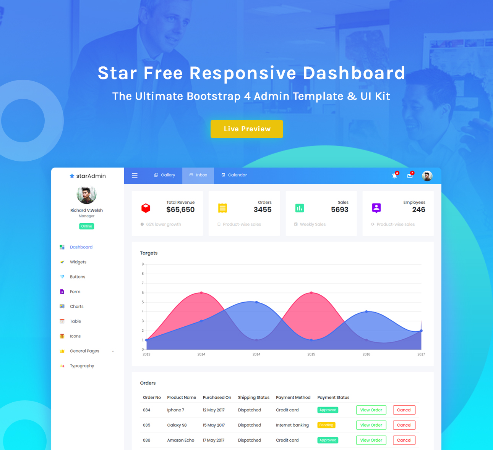

<h1>StarAdmin-Free-Bootstrap-Admin-Template</h1>
Star Admin is a free responsive admin template built with Bootstrap 4. The template has colorful, attractive yet simple and elegant design. The template is well crafted, with all the components neatly and carefully designed and arranged within the template.

Star Admin is packed with all the features that fit your needs but not cramped with components you would not even use. It is an excellent fit to build admin panels, e-commerce systems,  project management systems, CMS or CRM.

Although the template has a design like none other, it is easily customizable to suit your requirements. Star Admin comes with a clean and well-commented code that makes it easy to work with the template. Thus making it an ideal pick for jump starting your project.

<h1>Credits:</h1>

- Bootstrap 4
- Font Awesome
- jQuery
- Gulp
- Chart.js
- Google Maps
- Perfect Scrollbar

<h1>Browser Support:</h1>

StarAdmin is designed to work flawlessly with all the latest and modern web browsers.

- Chrome (latest)
- FireFox (latest)
- Safari (latest)
- Opera (latest)
- IE10+  

<h1>License Information:</h1>

Star Admin is released under MIT license. Star Admin is a free Bootstrap 4 admin template developed from BootstrapDash. Feel free to download it, use it, share it, get creative with it.

<h1>How to use Star Admin?</h1>

1 - Click the Clone or Download button in GitHub and download as a ZIP file or you can enter the command git clone https://github.com/BootstrapDash/StarAdmin-Free-Bootstrap-Admin-Template.git in you terminal to get a copy of this template.

2 - After the files have been downloaded you will get a folder with all the required files

3 - You can install all the dependencies in the template by running the command npm install. All the required files are in the node modules.

4 - Find the file named index.html, check what all components you need. Open the file in a text editor and you can start editing.

5 - Now that your project has now kick-started, all you need to do now is to code, code, and code to your heart's content.

<h1>How to Contribute?:</h1>

We love your contributions and we welcome them wholeheartedly. We believe the more the merrier.
To contribute make sure you have a Node.js and npm installed. Now run the command gulp --version. If the command returns with the Gulp version number, it means you have Gulp installed. If not you need to run the command npm install --global gulp-cli to install Gulp.

<h2>Next</h2>

After Gulp has been installed, follow the steps below to contribute.
   
	1 - Fork and clone the repo of Star Admin.
   
	2 - Run the command npm install to install all the dependencies.
   
	3 - Enter the command gulp serve. This will open Star Admin in your default browser.
   
	4 - Make you valuable contribution
   
	5 - Submit a pull request.
  

	Do you need a template with more features and functionalities? Get more with our collection of the premium template with more plugins, eye catching animations, UI components, and sample pages all fitting together with a high-quality design.
Visit
  <a href="https://www.bootstrapdash.com" target="_blank">https://www.bootstrapdash.com</a> for more admin templates.
